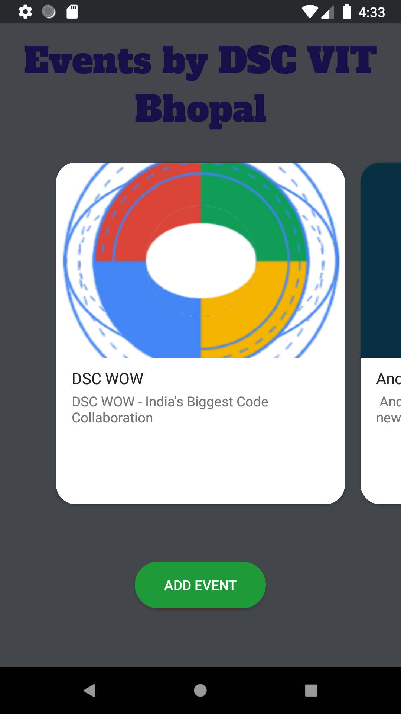
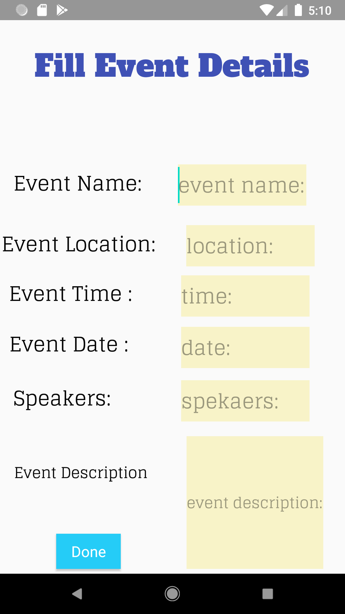
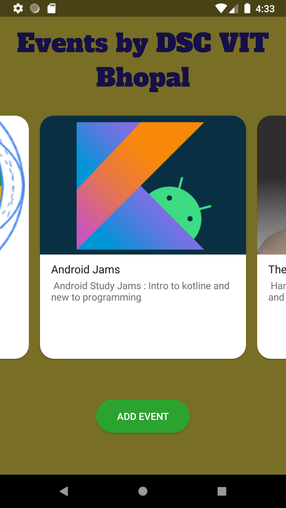

# EventAppDSC

>## Task for getting into Android Technical Team of DSC VIT-Bhopal. 

## Task - 
> As DSC VITB chapter is one of the biggest chapters in our college and we are hosting around 5-6 events every month. So you need to design a android app in which all the users get all the information about upcoming events. 

> You need to design the app in such a way so that every event has its own card and when the user opens the cards, he will get all details such as meeting link, time, Speaker’s detail, location of event …. Etc. 
Also add an option to create an event. 

## My Attempt - 
 
- The App includes a material design CardView of each event.
- The App has the required information of speaker, event description, date and time etc.
- Obviously the data added into the app is hardcoded because there is no database for reference, from where the data of the details of the event can be taken. 
- On clicking any card, more information of the event can be viewed. 
- A button is also present in the details section of the event which redirects the user to the event page. 
- Lastly 'Add New Event' button is present on the main activity to add a new event which then redirects the user and asks the user to give necessary event details. 
- After filling the details a new card is added on the events main page which shows that the new event is registered. 

## Screenshots of the app- 
   

## Note - 

There is scope of many improvements which can be done in the app if there is a database of the events and we integrate the database into the app. 
